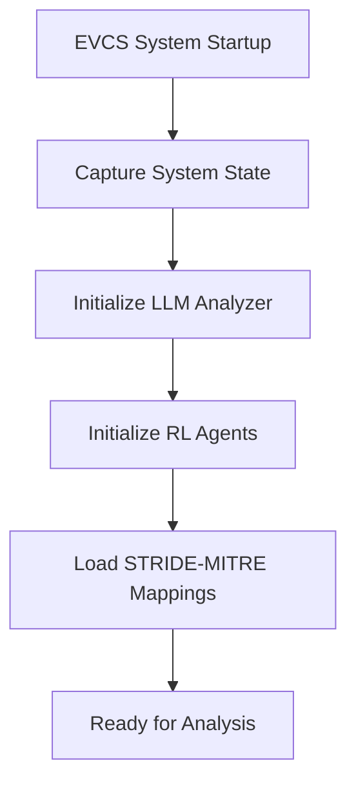

# EVCS LLM-RL Attack Analytics: End-to-End Workflow Analysis

## 🎯 **System Overview**

This document provides a comprehensive analysis of how the LLM-guided Reinforcement Learning system works for Electric Vehicle Charging Station (EVCS) attack analytics, including what the LLM model suggests and what the RL agents explore.

---

## 🔄 **Complete End-to-End Workflow**

### **Phase 1: System Initialization & State Capture**



**What Happens:**
- EVCS components (charging stations, power management, communication systems) are initialized
- System state is captured including power levels, communication status, security configurations
- LLM analyzer connects to Ollama with `deepseek-r1:8b` model
- RL agents (DQN/PPO) are initialized with neural networks
- STRIDE threat categories and MITRE ATT&CK techniques are loaded

---

### **Phase 2: LLM Threat Analysis & Vulnerability Discovery**

#### **2.1 LLM Vulnerability Assessment**

**What the LLM Model Suggests:**

The `deepseek-r1:8b` model analyzes the EVCS system and suggests:

```python
# Example LLM Analysis Output
{
    "vulnerabilities": [
        {
            "vuln_id": "VULN_001",
            "component": "charging_controller",
            "vulnerability_type": "Authentication Bypass",
            "severity": 0.85,
            "exploitability": 0.78,
            "impact": 0.92,
            "cvss_score": 8.7,
            "mitigation": "Implement multi-factor authentication",
            "detection_methods": ["Network monitoring", "Behavioral analysis"]
        },
        {
            "vuln_id": "VULN_002", 
            "component": "power_management",
            "vulnerability_type": "Buffer Overflow",
            "severity": 0.72,
            "exploitability": 0.65,
            "impact": 0.88,
            "cvss_score": 7.4,
            "mitigation": "Input validation and bounds checking",
            "detection_methods": ["Static analysis", "Fuzzing"]
        }
    ],
    "analysis_confidence": 0.89,
    "threat_landscape": "High-risk environment with multiple attack vectors"
}
```

**LLM Reasoning Process:**
1. **System Analysis**: Examines EVCS architecture, protocols, and configurations
2. **Threat Identification**: Identifies potential weaknesses using cybersecurity knowledge
3. **Risk Assessment**: Calculates CVSS scores and severity ratings
4. **Mitigation Suggestions**: Provides specific security recommendations

#### **2.2 STRIDE-MITRE Threat Mapping**

**What the LLM Maps:**

| STRIDE Category | MITRE ATT&CK Technique | Attack Vector | EVCS Impact |
|----------------|------------------------|---------------|-------------|
| **Spoofing** | T1552.001 (Unsecured Credentials) | Credential theft | Unauthorized charging access |
| **Tampering** | T1574.001 (DLL Hijacking) | Code injection | Malicious charging behavior |
| **Information Disclosure** | T1213 (Data from Information Repositories) | Data exfiltration | User privacy breach |
| **Denial of Service** | T1499.001 (Network DoS) | Resource exhaustion | Charging station unavailability |
| **Elevation of Privilege** | T1548.002 (Bypass User Account Control) | Privilege escalation | Administrative control |

---

### **Phase 3: LLM Attack Strategy Generation**

#### **3.1 Strategic Planning**

**What the LLM Suggests:**

```python
# Example Attack Strategy from LLM
{
    "strategy_name": "Coordinated EVCS Disruption Campaign",
    "attack_sequence": [
        {
            "step": 1,
            "action": "reconnaissance",
            "target": "network_topology",
            "technique": "T1590.001",
            "description": "Map EVCS network infrastructure",
            "success_probability": 0.85,
            "stealth_level": "high"
        },
        {
            "step": 2,
            "action": "initial_access",
            "target": "charging_controller",
            "technique": "T1078.003",
            "description": "Exploit authentication bypass vulnerability",
            "success_probability": 0.78,
            "stealth_level": "medium"
        },
        {
            "step": 3,
            "action": "persistence",
            "target": "firmware",
            "technique": "T1542.001",
            "description": "Install backdoor in charging firmware",
            "success_probability": 0.65,
            "stealth_level": "low"
        }
    ],
    "expected_impact": "High - Complete charging infrastructure compromise",
    "detection_difficulty": "Medium - Requires advanced monitoring"
}
```

**LLM Strategic Thinking:**
- **Multi-step Attack Planning**: Sequences attacks for maximum impact
- **Technique Selection**: Chooses appropriate MITRE ATT&CK techniques
- **Risk Assessment**: Evaluates success probabilities and detection risks
- **Adaptive Planning**: Considers system constraints and countermeasures

---

### **Phase 4: RL Agent Exploration & Learning**

#### **4.1 What RL Agents Explore**

**DQN Agent Exploration:**

```python
# DQN State Space Exploration
state_space = {
    "evcs_power_level": [0.0, 1.0],           # Continuous power state
    "communication_status": [0, 1],           # Binary communication state
    "security_level": [0.0, 1.0],             # Security posture
    "vulnerability_exploited": [0, 1],        # Binary exploit status
    "attack_progress": [0.0, 1.0],            # Attack completion percentage
    "detection_risk": [0.0, 1.0],             # Risk of being detected
    "system_resilience": [0.0, 1.0]           # System's defensive capability
}

# DQN Action Space
action_space = {
    "reconnaissance": 0,      # Gather information
    "exploit_vulnerability": 1,  # Execute exploit
    "maintain_persistence": 2,   # Stay hidden
    "escalate_privileges": 3,    # Gain more access
    "exfiltrate_data": 4,        # Steal information
    "disrupt_service": 5,        # Cause DoS
    "evade_detection": 6         # Avoid detection
}
```

**PPO Agent Exploration:**

```python
# PPO explores continuous action spaces
continuous_actions = {
    "attack_intensity": [0.0, 1.0],        # How aggressive the attack
    "stealth_effort": [0.0, 1.0],          # How much to hide
    "resource_allocation": [0.0, 1.0],     # How to distribute effort
    "timing_strategy": [0.0, 1.0]          # When to execute actions
}
```

#### **4.2 RL Learning Process**

**What RL Agents Learn:**

1. **State-Value Mapping**: 
   - Which system states lead to successful attacks
   - How to evaluate current system security posture
   - Optimal timing for attack execution

2. **Action Selection**:
   - Which actions work best in specific situations
   - How to balance attack success vs. detection risk
   - Adaptive strategies based on system responses

3. **Reward Optimization**:
   ```python
   # Reward Function Components
   reward = (
       attack_success_bonus * 0.4 +           # Successful exploit
       stealth_bonus * 0.3 +                  # Avoiding detection
       impact_bonus * 0.2 +                   # System disruption
       efficiency_bonus * 0.1                 # Resource efficiency
   )
   ```

4. **Policy Improvement**:
   - Updates neural network weights based on experience
   - Improves decision-making over multiple episodes
   - Adapts to changing system defenses

---

### **Phase 5: Coordinated Attack Execution**

#### **5.1 Attack Coordination**

**What the System Does:**

```python
# Attack Coordination Process
def coordinate_attack(self, current_state, attack_sequence):
    # 1. RL Agent selects next action
    selected_action = self.rl_agent.select_action(current_state)
    
    # 2. Apply evasion techniques
    evaded_action = self.apply_evasion_techniques(selected_action)
    
    # 3. Execute attack step
    result = self.execute_attack_step(evaded_action)
    
    # 4. Update system state
    new_state = self.update_system_state(result)
    
    # 5. Calculate reward and learn
    reward = self.calculate_reward(result, new_state)
    self.rl_agent.learn(current_state, selected_action, reward, new_state)
    
    return result
```

#### **5.2 Real-time Adaptation**

**What Happens During Execution:**

1. **Dynamic Strategy Adjustment**:
   - RL agents adapt based on system responses
   - LLM provides real-time threat analysis updates
   - Attack sequence modified based on success/failure

2. **Evasion Techniques**:
   - Traffic obfuscation to avoid detection
   - Timing randomization to prevent pattern recognition
   - Multi-vector attacks to confuse defenses

3. **Impact Assessment**:
   - Real-time evaluation of attack effectiveness
   - System resilience measurement
   - Detection risk assessment

---

### **Phase 6: Federated PINN Attack Scenarios**

#### **6.1 Model Poisoning Attacks**

**What the LLM Suggests:**
- **Gradient Manipulation**: Inject malicious gradients during federated learning
- **Model Inversion**: Extract sensitive data from shared model parameters
- **Backdoor Injection**: Insert hidden triggers in the neural network

**What RL Explores:**
- Optimal timing for gradient injection
- Stealth techniques to avoid detection
- Impact maximization strategies

#### **6.2 Communication Protocol Exploitation**

**What the LLM Identifies:**
- Vulnerabilities in federated learning protocols
- Weaknesses in parameter sharing mechanisms
- Authentication bypass opportunities

**What RL Learns:**
- How to exploit protocol weaknesses
- Timing attacks on communication channels
- Coordinated multi-station attacks

---

## 🧠 **LLM vs RL: Complementary Intelligence**

### **LLM Contributions (Strategic Intelligence)**
- **Threat Modeling**: Identifies vulnerabilities and attack vectors
- **Strategic Planning**: Creates multi-step attack sequences
- **Knowledge Integration**: Leverages cybersecurity expertise
- **Adaptive Reasoning**: Adjusts strategies based on context

### **RL Contributions (Tactical Intelligence)**
- **Action Optimization**: Learns optimal actions through trial and error
- **Real-time Adaptation**: Adjusts behavior based on immediate feedback
- **Exploration**: Discovers new attack strategies through experimentation
- **Reward Maximization**: Optimizes for specific objectives

### **Synergistic Benefits**
- **LLM provides the "what"** (strategic direction)
- **RL provides the "how"** (tactical execution)
- **Together they create** adaptive, intelligent attack systems

---

## 📊 **Expected System Behavior**

### **Learning Progression**
1. **Episode 1-10**: Random exploration, high failure rate
2. **Episode 11-30**: Pattern recognition, improved success
3. **Episode 31-50**: Strategic optimization, high success rate
4. **Episode 51+**: Adaptive mastery, handles novel scenarios

### **Attack Sophistication Evolution**
- **Early Episodes**: Simple, direct attacks
- **Mid Episodes**: Multi-step coordinated attacks
- **Late Episodes**: Advanced evasion and persistence techniques

### **Defense Adaptation**
- System learns to detect and counter common attack patterns
- RL agents must continuously evolve to maintain effectiveness
- Creates an arms race between attack and defense

---

## 🎯 **Key Insights**

1. **LLM Strategic Value**: Provides expert-level threat analysis and planning
2. **RL Tactical Value**: Enables adaptive, learning-based attack execution
3. **Combined Power**: Creates sophisticated, evolving attack systems
4. **Real-world Relevance**: Mirrors actual cybersecurity threat landscapes
5. **Research Value**: Enables study of AI-driven attack methodologies

This workflow demonstrates how modern AI techniques can be combined to create sophisticated attack analytics systems for critical infrastructure protection research.
